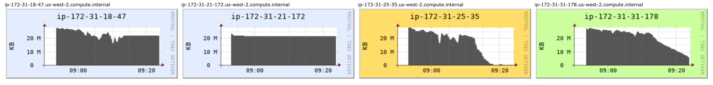

# Speeding up LDBC SNB Datagen

# Introduction

LDBC's Social Network Benchmark (LDBC SNB) is an industrial and academic initiative, formed by principal actors in the field of graph-like data management. Its goal is to define a framework where different graph-based technologies can be fairly tested and compared, that can drive the identification of systems' bottlenecks and required functionalities, and can help researchers to open new research frontiers.

LDBC SNB provides Datagen (Data Generator), which produces synthetic datasets, mimicing a social network's activity during a period of time. Datagen is defined by the charasteristics of realism, scalability, determinism and usability. To address scalability in particular, Datagen is implemented on the MapReduce platform to enable scaling out to a distributed cluster. Since its inception in the early 2010s, there have been a tremendous amount of development in the big data landscape, so it makes sense reevaluate this decision. More specifically, whether we were better off using Apache Spark instead.

# Overview

The format of this post allows for a minimal introduction only, see [References](#References) for details. The benchmark's specification describes a social network [data model](https://github.com/ldbc/ldbc_snb_docs/blob/dev/figures/schema.pdf), which has a static and a dynamic part. The dynamic part synthesizes a network where people have friends, post in forums, comment or like others' posts, etc. The static part contains information about countries, universities and organizations and is constant in time. 

Datasets are generated in a multi-stage process shown in the diagram below.

Briefly, in the initialization phase, dictionaries are populated and distributions are initialized. In the first generation phase, only persons are synthesized, then relationships are wired between them along 3 dimensions (university, interest and random). After merging the graph of person relationships, the resulting dataset is outputted. Then, activities such as forum posts, comments, likes and photos are generated and outputted. Finally, the static part is outputted.

The diagram shows the call sequence as implemented. However, after inspecting the data dependencies we can find that some steps could be run concurrently in theory, as they don't depend on the others' output. For example the creating the 3 'knows' edge dimensions can be parallelized, as well as serializing persons while generating person activities. 

Entities are represented as classes and generated procedurally in plain Java. Most entities follow a shallow representation, i.e foreign keys in the ER model are mapped to integer ids. This enables a straightforward mapping to tabular format often used by big data platforms. One exception from this is the `Knows` edge, which contains only the target node, and used as a navigation property on the source `Person`. The target `Person` is replaced with only the 'foreign key' augmented with some additional information, to keep the structure free of cycles. Needless to say, this 'edge as property' representation makes it more cumbersome to handle in SQL than it would be with a flat join table.

Entity generation amounts to circa one fifth of the main codebase. Most of it involves procedurally generating properties piecewise drawing from several random distributions using mutable pRNGs. Determinism is achieved by initializing the pRNGs to seeds fully defined by the configuration, and otherwise having no external state. It's hard to imagine this done declaratively in SQL.

Serialization is done by hand-written serializers for the supported output formats (CSV currently) and comprises just a bit less than one third of the main codebase. Most of the files are created with the low-level HDFS libraries. Ideally, they should migrated to higher level writers which can handle faults and give consistent results when the task is retried.

# Motivations for the migration

The application is written on Hadoop MapReduce, which is now largely superseded by more modern distributed batch processing platforms. I proposed to the team to migrate Datagen to Apache Spark, which provides the following benefits:

**Memory under-utilization** MapReduce is disk-oriented, which means that after each reduce stage, we have to write the output to disk and read it in the next phase. As public clouds provide virtual machines with capable amounts of RAM for cheap nowadays, we are wasting time - and money by doing unneccessary disk I/O. This is one of the most well-known shortcomings of MapReduce.

**Smaller codebase** Working with the rather low-level elements of MapReduce is fairly ceremonial and boilerplaty. RDDs provide a higher-level abstraction that's simpler to work with, while still providing enough control on the lower-level details we required in this workload.

**Small entry cost** Spark uses HDFS under the hood, and the two frameworks are very close conceptually. We can start using it with relatively small effort.

**Incremental improvements** Spark is a platform exposing many APIs for different workloads and operating on different levels of abstraction. While the low-level, Java oriented RDDs offer some advantages when coming from MapReduce with relatively small changes to the existing codebase. We can gradually move towards DataFrames to support Parquet output in the serializers and mayble unlock some SQL optimization capabilities in the generators later on.

**OSS, commodity** Spark is one of the most widely used big data platforms, OSS and with managed offerings from every major public cloud provider, so the migration increases the approachability and cost-effectiveness.

# First steps

The first milestone is a successful run of LDBC Datagen on Spark. For this we only want to touch the absolute necessary code paths. These consists of at least the Hadoop wrappers around the generators and serializers. My approach was migrating the generator classes one by one and porting the serializers after them if necessary.

**Regression tests** Lacking tests apart from an id uniqueness check, we had no means to detect bugs introduced by the migration. Designing and implementing these was out of scope, so I resorted to regression testing, with the MapReduce output as the baseline. Most of these are Hadoop sequence files which Spark supports, so I could just read them and compare with the results of the RDD produced by the migrated code.

**Multi-threading issues** Soon after migrating the first generator and running the regression tests, I started to face discrepancies in the output. These only surfaced when I set the parallization level larger than 1. This indicated the presence of possible race condition. Thread-safety wasn't a concern in the original implementation, due to the fact that MapReduce doesn't use thread-based parallelization for mappers and reducers1. In Spark however, tasks are executed by parallel threads in the same JVM application, so the code should be thread safe. After some debugging, I found one bug originating from the shared use of `java.text.SimpleDateFormat` in serializers which is notoriously not thread-safe. This was resolved simply by changing to `java.time.format.DateTimeFormatter`. There were multiple instances of some static field on an object being mutated concurrently. In some cases this was a temporary buffer and was easily resolved by making it an instance variable. In another case a shared context variable was used, which I resolved by passing dedicated instances as function arguments. Sadly, the Java language has the same syntax for accessing locals, fields and statics 2, which makes it somewhat harder to detect the usage scope. Fortunately, in no case I needed to introduce a new mutex or concurrent collection.

**Use your memory!** I focused on keeping the call sequence intact, so that the migrated code evaluates the same steps in the same order, but with the data passed as RDDs. The initial runs showed that we can generate . We can add `MEMORY_AND_DISK` caching strategy if we undersize memory.

# Case study: Person ranking

Migrating the majority of the generators was rather straightforward, however the so called person ranking step required some thought. Its goal is to organize persons so that similar ones appear close to each other in a deterministic order. This provides a scalabled way to cluster persons according to a similarity metric, as introduced in the [S3G2 paper](#s3g2).

## The original MapReduce version

The implementation is as follows. First, the equivalence keys are mapped to each person and fed into `TotalOrderPartitioner` which maintains an order sensitive partitioning while still trying to emit more or less equal sized groups to keep the data skew low (1). The reducer keys the partitions with its task id, and a counter variable which has been initilized to zero and is incremented on each person, establishing a local ranking inside the group. The final state of the counter (which is the total number of persons in that group) is saved to file for each separate reducer (2). Then, in a reduce-only stage, the global order is established by reading all previously emitted count files in order in each reducer, then creating an ordered map of each partition number to the corresponding cumulative count of the preceding ones. This is done in the setup phase. In the `reduce` function, count is advanced on each person for the given partition id (3).

Once this ranking is done, the whole range is sliced up into equally sized blocks, which are processed independently. E.g. when wiring relationships between persons, only those appearing in the same block are considered.

## The migrated version

Spark provides a `sortBy` function which takes care of the first step in a single line. The gist of the problem is collecting the partition sizes and making available in a later step. While the MapReduce version uses a side output, we can collect the partition sizes in separate job and pass them into the next phase using a broadcast variable in Spark. The resulting code size is a small fraction of the original one.

# Benchmarks

Benchmarks were carried out on [AWS EMR](https://aws.amazon.com/emr). I decided to use High I/O [I3](https://aws.amazon.com/ec2/instance-types/i3/) instances on the onset because of their fast NVMe SSD storage and capable amount of RAM.

There's a an application parameter `hadoop.numThreads` which controls the number of reduce threads in each Hadoop job for the MapReduce version, while in the Spark version, the number of partitions in the serialization jobs. I set this `n_nodes` in case of Hadoop as larger values caused slowdown. For the Spark version I increasing it to `n_nodes * v_cpu` yielded some speed. The MapReduce results as follows:

| SF  | workers | Platform  | Instance Type | runtime (min) | runtime * worker/SF (min) |
|-----|---------|-----------|---------------|---------------|---------------------------|
| 10  | 1       | MapReduce | i3.xlarge     | 16            | 1.60                      |
| 30  | 1       | MapReduce | i3.xlarge     | 34            | 1.13                      |
| 100 | 3       | MapReduce | i3.xlarge     | 40            | 1.20                      |
| 300 | 9       | MapReduce | i3.xlarge     | 44            | 1.32                      |

The cost per scale factor only creeps up slowly, which is good, albeit it already starts from a high point. On the metrics charts below we can see an underutilized, bursty CPU. The bursts are supposedly interrupted by the disk I/O heavy parts occuring when writing the results of a completed job. We can also see that the memory only starts to get eaten when we are already 10 minutes into the run. 

CPU Load for the Map Reduce cluster is bursty and less than 50% on average (SF100)

The job only starts to consume memory when already 10 minutes into the run (SF100)

Let's see how Spark does:

| SF   | workers | Platform | Instance Type | runtime (min) | runtime/SF/worker (min) |
|------|---------|----------|---------------|---------------|-------------------------|
| 10   | 1       | Spark    | i3.xlarge     | 10            | 1.00                    |
| 30   | 1       | Spark    | i3.xlarge     | 21            | 0.70                    |
| 100  | 3       | Spark    | i3.xlarge     | 27            | 0.81                    |
| 300  | 9       | Spark    | i3.xlarge     | 36            | 1.08                    |
| 1000 | 30      | Spark    | i3.xlarge     | 47            | 1.41                    |
| 3000 | 90      | Spark    | i3.xlarge     | 47            | 1.41                    |

A similar trend here, however with lower values. I also run Spark for larger scale factors, which yielded diminishing run times. On the metrics charts, we can see a fully utilized CPU, except in the end, when the results are serialized in one go, and the CPU is basically idle (the snapshot of the diagram doesn't include this part unfortunately). We can see that Spark used up all memory pretty fast even in case of SF100. My hypothesis attributes the slowdowns noticed in SF1000 and SF3000 to the fact that the nodes are running low on memory, and have to calculate some RDDs multiple times (no disk level serialization was used here). In fact, I encountered a few OOM errors when running SF3000, so we should consider adding some juice (CPU and RAM) to the nodes.

Full CPU utilization for Spark (SF100)

Spark eats up memory fast (SF100)

i3.2xlarge would be the most straightforward option, however the humongous 1,9 TB disk is completely superflouos for these jobs, so we can go with the cheaper r5d.xlarge, which is largely identical, except it _only_ has a 300 GB NVMe SSD.

| SF   | workers | Platform | Instance Type | runtime (min) | runtime * worker/SF (min) |
|------|---------|----------|---------------|---------------|---------------------------|
| 100  | 3       | Spark    | r5d.2xlarge   | 16            | 0.48                      |
| 300  | 9       | Spark    | r5d.2xlarge   | 21            | 0.63                      |
| 1000 | 30      | Spark    | r5d.2xlarge   |               |                           |
| 3000 | 90      | Spark    | r5d.2xlarge   |               |                           |

# Next steps

The next logical step is refactoring the serializers so they use Spark's high-level writer facilities. The most compelling benefit is that it will make the jobs fault-tolerant, as Spark's writers make sure that the integrity of the output is kept in face of task failures. This makes Datagen more resilient and opens up the possibility to run on less reliable hardware configuration (EC2 spot nodes on AWS) for additional cost savings. They will supposedly also yield some speedup on the same cluster configuration. 

# References

- [9th TUC Meeting – LDBC SNB Datagen Update – Arnau Prat (UPC)](https://www.youtube.com/watch?v=ZQOLuCOOpSI) - [slides](http://wiki.ldbcouncil.org/pages/viewpage.action?pageId=59277315&preview=/59277315/75431942/datagen_in_depth.pdf)
- [S3G2: a Scalable Structure-correlated Social Graph Generator](https://research.vu.nl/en/publications/s3g2-a-scalable-structure-correlated-social-graph-generator)
- 

1 Instead, multiple YARN containers have to be used if you want to parallelize on the same machine. 
2 Although editors usually render these using different font styles.

