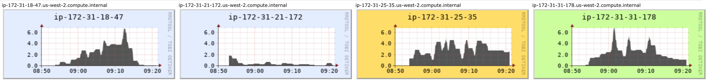

# Speeding up LDBC SNB Datagen

# Introduction

LDBC's [Social Network Benchmark](#snb) (LDBC SNB) is an industrial and academic initiative, formed by principal actors in the field of graph-like data management. Its goal is to define a framework where different graph-based technologies can be fairly tested and compared, that can drive the identification of systems' bottlenecks and required functionalities, and can help researchers open new frontiers in high-performance graph data management. 

LDBC SNB provides [Datagen](https://github.com/ldbc/ldbc_snb_datagen) (Data Generator), which produces synthetic datasets, mimicing a social network's activity during a period of time. Datagen is defined by the charasteristics of realism, scalability, determinism and usability. To address scalability in particular, Datagen has been implemented on the MapReduce computation model to enable scaling out across a distributed cluster. However, since its inception in the early 2010s there has been a tremendous amount of development in the big data landscape, both in the sophistication of distributed processing platforms, as well as public cloud IaaS offerings. In the light of this, we should reevaluate this implementation, and in particular, investigate if Apache Spark would be a more cost-effective solution for generating datasets on the scale of tens of terabytes, on public clouds such as Amazon Web Services (AWS).

# Overview

The benchmark's specification describes a social network [data model](https://github.com/ldbc/ldbc_snb_docs/blob/dev/figures/schema.pdf) which divides its components into two broad categories: static and dynamic. The dynamic element consists of an evolving network where people make friends, post in forums, comment or like each others posts, etc. In contrast, the static component contains related attributes such as countries, universities and organizations and are fixed values. For the detailed specifications of the benchmark and the Datagen component, see [References](#References).

Datasets are generated in a multi-stage process captured as a sequence of MapReduce steps (shown in the diagram below).

_Figure 1. LDBC SNB Datagen Process on Hadoop_

In the initialization phase dictionaries are populated and distributions are initialized. In the first generation phase persons are synthesized, then relationships are wired between them along 3 dimensions (university, interest and random). After merging the graph of person relationships, the resulting dataset is output. Following this, activities such as forum posts, comments, likes and photos are generated and output. Finally, the static components are output.

_Note: The diagram shows the call sequence as implemented. All steps are sequential – including the relationship generation –, even in cases when the data dependencies would allow for parallelization._ 

Entities are generated by procedural Java code and are represented as POJOs in memory and as sequence files on disk. Most entities follow a shallow representation, i.e foreign keys (in relational terms) are mapped to integer ids, which makes serialization straightforward.[1](#fn1) A notable exception is the `Knows` edge which contains only the target vertex, and is used as a navigation property on the source `Person`. The target `Person` is replaced with only the foreign key augmented with some additional information in order to keep the structure free of cycles. Needless to say, this _edge as property_ representation makes the data harder to handle in SQL than it would be with a flat join table.

Entity generation amounts to roughly one fifth of the main codebase. It generates properties drawn from several random distributions using mutable pRNGs. Determinism is achieved by initializing the pRNGs to seeds that are fully defined by the configuration with constants, and otherwise having no external state in the logic.[2](#fn2) 

Serialization is done by hand-written serializers for the supported output formats (e.g. CSV) and comprises just a bit less than one third of the main codebase. Most of the output is created by directly interacting with low-level HDFS file streams. Ideally, this code should be migrated to higher-level writers that handle faults and give consistent results when the task has to be restarted.

# Motivations for the migration

The application is written using Hadoop MapReduce, which is now largely superseded by more modern distributed batch processing platforms, notably Apache Spark. For this reason, it was proposed to migrate Datagen to Spark. The migration provides the following benefits:

- **Better memory utilization** MapReduce is disk-oriented, i.e. it writes the output to disk after each reduce stage which is then read by the next MapReduce job. As public clouds provide virtual machines with sufficient RAM to encapsulate any generated dataset, time and money are wasted by the overhead this unnecessary disk I/O incurs. Instead the intermediate results should be cached in memory where possible. The lack of support for this is a well-known limitation of MapReduce.

- **Smaller codebase** The Hadoop MapReduce library is fairly ceremonial and boilerplaty. Spark provides a higher-level abstraction that is simpler to work with, while still providing enough control on the lower-level details required for this workload.

- **Small entry cost** The MapReduce and Spark frameworks are very close conceptually, as they both utilise HDFS under the hood and run the JVM. This means that a large chunk of the existing code can be reused, and migration to Spark can, therefore, be completed with relatively small effort. Additionally, MapReduce and Spark jobs can be run on AWS EMR using basically the same HW/SW configuration, which facilitates straightforward performance comparisons.

- **Incremental improvements** Spark exposes multiple APIs for different workloads and operating on different levels of abstraction. Datagen may, therefore, initially utilise the lower-level, Java-oriented RDDs (which offer the clearest 1 to 1 mapping when coming from MapReduce) and gradually move towards DataFrames to support Parquet output in the serializers and maybe unlock some SQL optimization capabilities in the generators later down the road.

- **OSS, commodity** Spark is one of the most widely used open-source big data platforms. Every major public cloud provides a managed offering for Spark. Together these mean that the migration increases the approachability and portability of the code. 

# First steps

The first milestone is a successful run of LDBC Datagen on Spark, while making the minimum necessary amount of code alterations. This entails the migration of the Hadoop wrappers around the generators and serializers. The following bullet-points summarize the key notions that cropped up during the process.

 - **Use your memory!**: A strong focus was placed on keeping the call sequence intact, so that the migrated code evaluates the same steps in the same order, but with data passed as RDDs. It was hypothesised that the required data could be either cached in memory entirely at all times, or if not, regenerating them would still be faster than involving the disk I/O loop (e.g by using `MEMORY_AND_DISK`). In short, the default caching strategy was used everywhere.

- **Regression tests**: Lacking tests apart from an id uniqueness check, meant there were no means to detect bugs introduced by the migration. Designing and implementing a comprehensive test suite was out of scope, so instead regression testing was utilised, with the MapReduce output as baseline. The ogirinal output mostly consists of Hadoop sequence files which can be read into Spark, allowing comparisons to be drawn with the output from the RDD produced by the migrated code.

- **Thread-safety concerns**: Soon after migrating the first generator and running the regression tests, there were clear discrepancies in the output. These only surfaced when the parallelization level was set greater than 1. This indicated the presence of potential race conditions. Thread-safety wasn't a concern in the original implementation due to the fact that MapReduce doesn't use thread-based parallelization for mappers and reducers.[3](#fn3) In Spark however, tasks are executed by parallel threads in the same JVM application, so the code is required to be thread-safe. After some debugging, a bug was discovered originating from the shared use of `java.text.SimpleDateFormat` (notoriously known to be not thread-safe) in the serializers. This was resolved simply by changing to `java.time.format.DateTimeFormatter`. There were multiple instances of some static field on an object being mutated concurrently. In some cases this was a temporary buffer and was easily resolved by making it an instance variable. In another case a shared context variable was used, which was resolved by passing dedicated instances as function arguments. Sadly, the Java language has the same syntax for accessing locals, fields and statics, [4](#fn4) which makes it somewhat harder to find potential unguarded shared variables.

# Case study: Person ranking

Migrating was rather straightforward, however the so-called person ranking step required some thought. The goal of this step is to organize persons so that similar ones appear close to each other in a deterministic order. This provides a scalable way to cluster persons according to a similarity metric, as introduced in the [S3G2 paper](#s3g2).

## The original MapReduce version

_Figure 2. Diagram of the MapReduce code for ranking persons_

The implementation, shown in pseudocode above, works as follows:

1. The equivalence keys are mapped to each person and fed into `TotalOrderPartitioner` which maintains an order sensitive partitioning while trying to emit more or less equal sized groups to keep the data skew low.
2. The reducer keys the partitions with its own task id and a counter variable which has been initialized to zero and incremented on each person, establishing a local ranking inside the group. The final state of the counter (which is the total number of persons in that group) is saved to a separate "side-channel" file upon the completion of a reduce task.
3. In a consecutive reduce-only stage, the global order is established by reading all of these previously emitted count files in the order of their partition number in each reducer, then creating an ordered map from each partition number to the corresponding cumulative count of persons found in all preceding ones. This is done in the setup phase. In the `reduce` function, the respective count is incremented and assigned to each person.

Once this ranking is done, the whole range is sliced up into equally sized blocks, which are processed independently. For example, when wiring relationships between persons, only those appearing in the same block are considered.

## The migrated version

Spark provides a `sortBy` function which takes care of the first step above in a single line. The gist of the problem remains collecting the partition sizes and making them available in a later step. While the MapReduce version uses a side output, in Spark the partition sizes are collected in a separate job and passed into the next phase using a broadcast variable. The resulting code size is a fraction of the original one.

# Benchmarks

Benchmarks were carried out on AWS [EMR](https://aws.amazon.com/emr/), originally utilising [`i3.xlarge`](https://aws.amazon.com/ec2/instance-types/i3/) instances because of their fast NVMe SSD storage and ample amount of RAM.

The application parameter `hadoop.numThreads` controls the number of reduce threads in each Hadoop job for the MapReduce version and the number of partitions in the serialization jobs in the Spark one. For MapReduce, this was set to `n_nodes`, i.e. the number of machines; experimentation yield slowdowns for higher values. The Spark version on the other hand, performed better with this parameter set to `n_nodes * v_cpu`. 
The scale factor (SF) parameter determines the output size. It is defined so that one SF unit generates around 1 GB of data. That is, SF10 generates around 10 GB, SF30 around 30 GB, etc. It should be noted however, that incidentally the output was only 60% of this in these experiments, stemming from two reasons. One, update stream serialization was not migrated to Spark, due to problems in the original implementation. Of course, for the purpose of faithful comparison the corresponding code was removed from the MapReduce version as well before executing the benchmarks. This explains a 10% reduction from the expected size. The rest can be attributed to incorrectly tuned parameters.[5](#fn5)
The MapReduce results were as follows:

| SF  | workers | Platform  | Instance Type | runtime (min) | runtime * worker/SF (min) |
|-----|---------|-----------|---------------|---------------|---------------------------|
| 10  | 1       | MapReduce | i3.xlarge     | 16            | 1.60                      |
| 30  | 1       | MapReduce | i3.xlarge     | 34            | 1.13                      |
| 100 | 3       | MapReduce | i3.xlarge     | 40            | 1.20                      |
| 300 | 9       | MapReduce | i3.xlarge     | 44            | 1.32                      |

It can be observed that the runtime per scale factor only increases slowly, which is good. The metric charts show an underutilized, bursty CPU. The bursts are supposedly interrupted by the disk I/O parts when the node is writing the results of a completed job. It can also be seen that the memory only starts to get consumed after 10 minutes of the run have passed.

_Figure 3. CPU Load for the Map Reduce cluster is bursty and less than 50% on average (SF100, 2nd graph shows master)_

_Figure 4. The job only starts to consume memory when already 10 minutes into the run (SF100, 2nd graph shows master)_

Let's see how Spark fares.

| SF   | workers | Platform | Instance Type | runtime (min) | runtime * worker/SF (min) |
|------|---------|----------|---------------|---------------|---------------------------|
| 10   | 1       | Spark    | i3.xlarge     | 10            | 1.00                      |
| 30   | 1       | Spark    | i3.xlarge     | 21            | 0.70                      |
| 100  | 3       | Spark    | i3.xlarge     | 27            | 0.81                      |
| 300  | 9       | Spark    | i3.xlarge     | 36            | 1.08                      |
| 1000 | 30      | Spark    | i3.xlarge     | 47            | 1.41                      |
| 3000 | 90      | Spark    | i3.xlarge     | 47            | 1.41                      |

A similar trend here, however the run times are around 70% of the MapReduce version. It can be seen that the larger scale factors (SF1000 and SF3000) yielded a long runtime than expected. On the metric charts of SF100 the CPU shows full utilization, except at the end, when the results are serialized in one go and the CPU is basically idle (the snapshot of the diagram doesn't include this part unfortunately). Spark can be seen to have used up all memory pretty fast even in case of SF100. In case of SF1000 and SF3000, the nodes are running so low on memory that most probably some of the RDDs have to be calculated multiple times (no disk level serialization was used here), which seem to be the most plausible explanation for the slowdowns experienced. In fact, the OOM errors encountered when running SF3000 supports this hypothesis even further. It was thus proposed to scale up the RAM in the instances. The CPU utilization hints that adding some extra vCPUs as well can further yield speedup.

_Figure 5. Full CPU utilization for Spark (SF100, last graph shows master)_

_Figure 6. Spark eats up memory fast (SF100, 2nd graph shows master)_

`i3.2xlarge` would have been the most straightforward option for scaling up the instances, however the humongous 1.9 TB disk of this image is completely unnecessary for the job. Instead the cheaper `r5d.2xlarge` instance was utilised, largely identical to `i3.2xlarge`, except it _only_ has a 300 GB SSD.

| SF    | workers | Platform | Instance Type | runtime (min) | runtime * worker/SF (min) |
|-------|---------|----------|---------------|---------------|---------------------------|
| 100   | 3       | Spark    | r5d.2xlarge   | 16            | 0.48                      |
| 300   | 9       | Spark    | r5d.2xlarge   | 21            | 0.63                      |
| 1000  | 30      | Spark    | r5d.2xlarge   | 26            | 0.78                      |
| 3000  | 90      | Spark    | r5d.2xlarge   | 25            | 0.75                      |
| 10000 | 303     | Spark    | r5d.2xlarge   | 25            | 0.75                      |

The last column clearly demonstrates our ability to keep the cost per scale factor unit constant.

# Next steps

The next improvement is refactoring the serializers so they use Spark's high-level writer facilities. The most compelling benefit is that it will make the jobs fault-tolerant, as Spark maintains the integrity of the output files in case the task that writes it fails. This makes Datagen more resilient and opens up the possibility to run on less reliable hardware configuration (e.g. EC2 spot nodes on AWS) for additional cost savings. They will supposedly also yield some speedup on the same cluster configuration.

As already mentioned, the migration of the update stream serialization was ignored due to problems with the original code. Ideally, they should be implemented with the new serializers.

The Spark migration also serves as an important building block for the next generation of LDBC benchmarks. As part of extending the SNB benchmark suite, the SNB task force has recently extended Datagen with support for [generating delete operations](#deletes). The next step for the task force is to fine-tune the temporal distributions of these deletion operations to ensure that the emerging sequence of events is realistic, i.e. the emerging distribution resembles what a database system would experience when serving a real social network.

# Acknowledgements

This work is based upon the work of Arnau Prat, Gábor Szárnyas, Ben Steer, Jack Waudby and other LDBC contributors. Thanks for your help and feedback!

# References

- [Supporting Dynamic Graphs and Temporal Entity Deletions in the LDBC Social Network Benchmark's Data Generator](http://ldbcouncil.org/sites/default/files/datagen-deletions-grades-nda-2020.pdf)
- [9th TUC Meeting – LDBC SNB Datagen Update – Arnau Prat (UPC)](https://www.youtube.com/watch?v=ZQOLuCOOpSI) - [slides](http://wiki.ldbcouncil.org/pages/viewpage.action?pageId=59277315&preview=/59277315/75431942/datagen_in_depth.pdf)
- [S3G2: a Scalable Structure-correlated Social Graph Generator](https://research.vu.nl/en/publications/s3g2-a-scalable-structure-correlated-social-graph-generator)
- [The LDBC Social Network Benchmark](https://arxiv.org/abs/2001.02299)
- [LDBC](http://www.ldbcouncil.org/) - [LDBC GitHub organization](https://github.com/ldbc)

<a name="fn1">1</a> Also makes it easier to map to a tabular format thus it is a SQL friendly representation.

<a name="fn2">2</a> It's hard to imagine this done declaratively in SQL.

<a name="fn3">3</a> Instead, multiple YARN containers have to be used if you want to parallelize on the same machine. 

<a name="fn4">4</a> Although editors usually render these using different font styles.

<a name="fn5">5</a> With the addition of deletes, entities often get inserted and deleted during the simulation (which is normal in a social network). During serialization, we check for such entities and omit them. However we forgot to calculate this when determining the output size, which we will amend when tuning the distributions.

